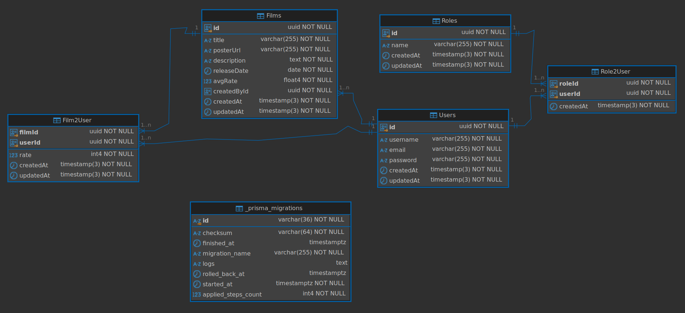
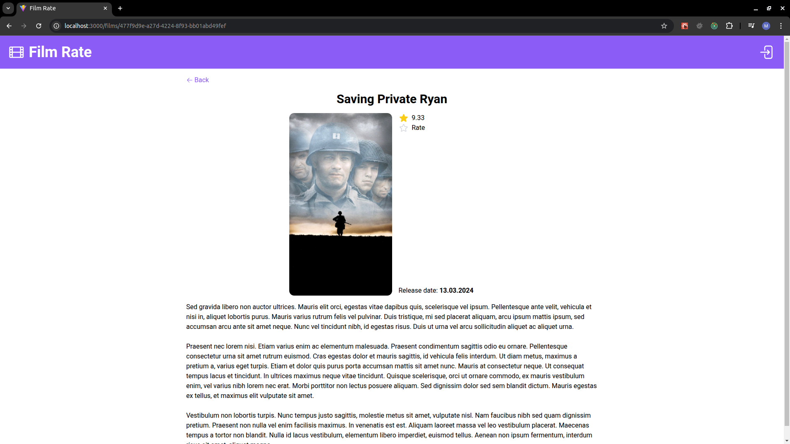
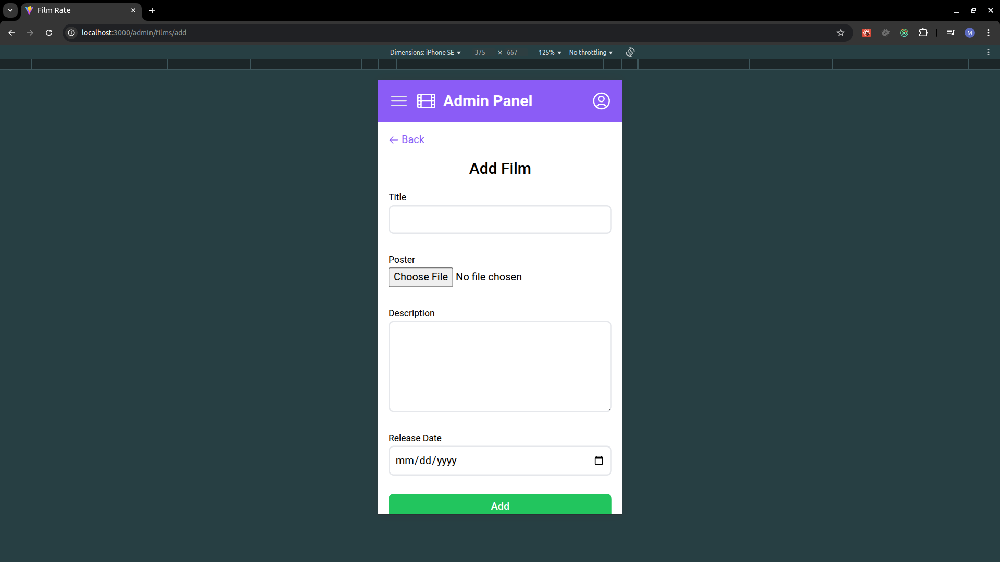

# Film Rate v2

## Table of content

- [App description](#app-description)
- [Tech stack](#tech-stack)
- [Database design and structure](#database-design-and-structure)
- [Installation](#installation)
- [Usage](#usage)
- [Features](#features)
- [Screenshots](#screenshots)

## App description

Film Rate v2 is the web application to rate films. The user can rate film, modify and remove the rate. The admin can also manage films. The web application allows to login to existing account and register a new one.

The Film Rate v2 is built using JS frameworks. It's the project for course "Advanced technologies of web application development".

## Tech stack

- Git
- Docker
- JavaScript
- TypeScript
- Node.js
- React
- Redux
- Tailwind CSS
- Heroicons
- NestJS
- Swagger
- PostgreSQL
- Redis

## Database design and structure

### ERD Diagram



## Installation

### Requirements

- Node.js
- NVM
- Docker
- Docker Compose

### Download Repository

Clone repository.

```
git clone git@github.com:MikiWojak/film-rate-v2.git
```

Go to project directory.

```
cd film-rate-v2
```

### Backend

Go to backend directory.

```
cd backend
```

Set up proper Node.js version. Download proper one if necessary.

```
nvm use
```

Install packages.

```
npm i
```

Create `.env` file with env variables. You can leave default ones. However it is strongly recommended to adjust the env variables, espiecially `JWT_SECRET_KEY`.

```
cp .env.example .env
```

Generate JWT secret key for the `.env` file.

```
openssl rand -base64 32
```

Run Docker containers in the background.

```
docker compose up -d
```

Set up database - run migrations and seeders.

```
npm run dev-db-setup-fresh
```

Run backend in dev mode.

```
npm run start:dev
```

### Frontend

Go to frontend directory.

```
cd frontend
```

Set up proper Node.js version. Download proper one if necessary.

```
nvm use
```

Install packages.

```
npm i
```

Create `.env` file with env variables. You can leave default ones.

```
cp .env.example .env
```

Run frontend in dev mode.

```
npm run dev
```

## Usage

### Run web application

#### Backend

Go to backend directory.

```
cd backend
```

Run Docker containers in the background.

```
docker compose up -d
```

Run backend in dev mode.

```
npm run start:dev
```

Clear cache if necessary (for default `REDIS_CACHE_PASS`).

```
npm run redis-cache-flush
```

#### Frontend

Go to frontend directory.

```
cd frontend
```

Run frontend in dev mode.

```
npm run dev
```

### Shut down web application

#### Frontend

Stop running frontend by clicking `Ctrl + c` in terminal where frontend has been launched.

#### Backend

Stop running backend by clicking `Ctrl + c` in terminal where backend has been launched.

Shut down Docker containers.

```
docker compose down
```

### Web application

- Go to location http://localhost:3000
- You can use application as unauthorized [Guest](#guest), however your possibilities will be significantly limited
- Click Login icon
- Login using one of these credentials:
  - User with role [Admin](#admin):
    - Email: **admin@filmrate.test**
    - Password: **Qwerty123!**
  - User with role [User](#user):
    - Email: **user@filmrate.test**
    - Password: **Qwerty123!**
- Now you can do actions permitted for specific role

### Database manager

- Use env variables for database specified in `backend/.env` to login to your database manager

### API documentation

- Go to location http://localhost:3001/api/docs
- Now you can browse the API documentation

## Features

### Guest

(unauthorized)

- View films
- View single film
- Login
- Register

### User

- View films
- View single film
- Rate film, edit and remove rate
- Profile page

### Admin

All User's features, also:

- See all films
- Add film

## Screenshots

### Desktop - Films


### Desktop - Single film



### Desktop - Register


### Desktop - Login


### Desktop - Rate film


### Desktop - Profile


### Desktop - Admin films


### Desktop - Admin add film


### Mobile - Films


### Mobile - Single film


### Mobile - Register


### Mobile - Login


### Mobile - Rate film


### Mobile - Profile


### Mobile - Admin films


### Mobile - Admin add film


